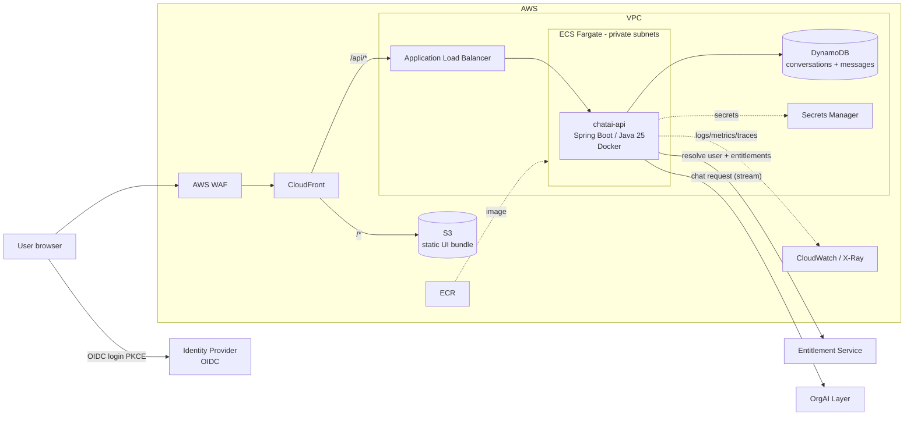
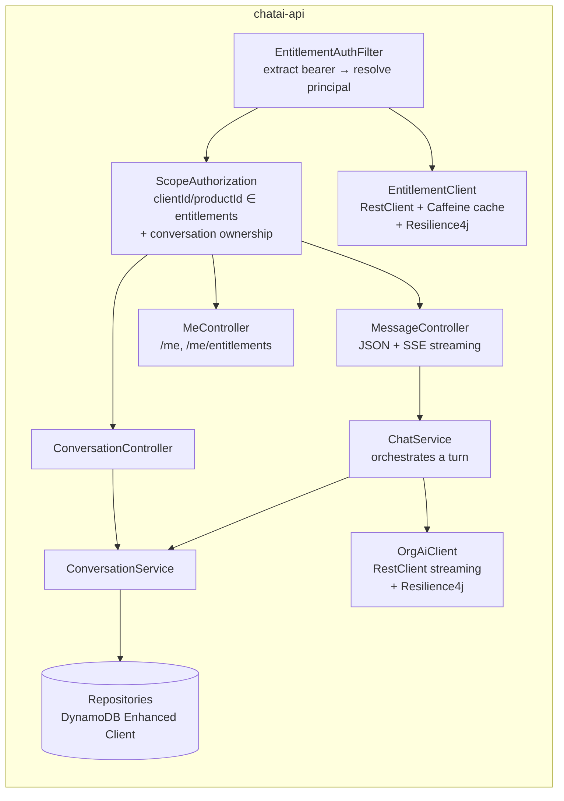
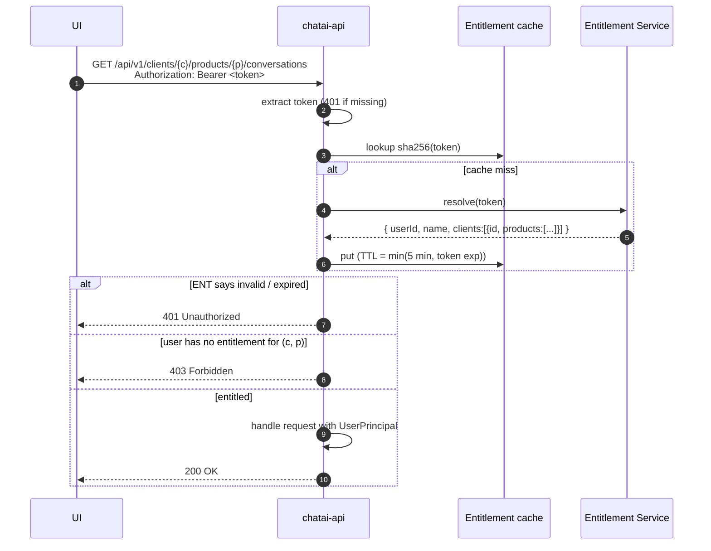
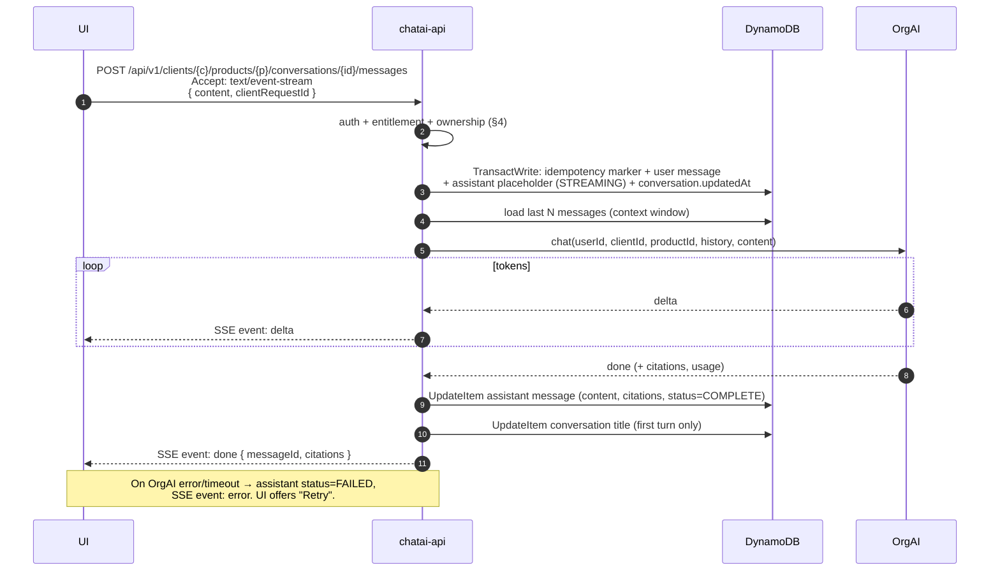

# chatAI — System Design

Internal ChatGPT-style assistant that lets employees chat with internal data through the existing **OrgAI** orchestration layer.
Every conversation is scoped to exactly one **client** and one **product** the user is entitled to.

> Status: design draft (v0.2 — DynamoDB + Caffeine chosen). Code comes after this is agreed.

---

## 1. Scope

| In scope (this project) | Out of scope (already exists) |
|---|---|
| Web UI (chat, history, client/product picker) | OrgAI orchestration layer (LLM + internal data retrieval) |
| Backend REST API (Java 25, Spring Boot, Docker) | Entitlement service (token → user → clients/products) |
| Entitlement enforcement on every request | Identity provider that issues the bearer token |
| Chat persistence (conversations + messages) | |
| AWS deployment | |

### Key requirements

1. UI and backend are separate deployables; UI talks to backend only over HTTP/JSON (+ SSE for streaming).
2. Every request carries `Authorization: Bearer <token>`.
3. Backend resolves the user and their entitlements via the entitlement service; unentitled → rejected.
4. User belongs to one or more **clients**; each client has a set of **products**. A conversation is bound to one `(client, product)` pair for its whole life.
5. Chats are persisted and listed/reopened in the UI like ChatGPT.
6. Everything runs on AWS.

---

## 2. High-level architecture



**Why this shape**

- **Single origin via CloudFront** (`/` → S3, `/api/*` → ALB): no CORS, one TLS cert, WAF in one place. UI and backend still deploy independently.
- **ECS Fargate** for the backend container: no cluster management, scales on CPU/request count. (EKS is a drop-in alternative if the org standardises on Kubernetes.)
- **DynamoDB** for chat history: the access patterns are fixed key lookups, it is serverless with pay-per-request pricing, and TTL handles retention (see §7).
- **Caffeine** in-process cache for entitlement lookups: free and nothing extra to run.
- Entitlement service and OrgAI are reached privately (VPC peering / PrivateLink / Transit Gateway — whatever the org already uses).

---

## 3. Backend components (chatai-api)



### Tech choices

| Concern | Choice | Note |
|---|---|---|
| Runtime | Java 25 (LTS), Spring Boot 4.x | `spring.threads.virtual.enabled=true` — virtual threads make blocking calls to OrgAI/entitlements and long-lived SSE cheap |
| Web | Spring MVC + `SseEmitter` | Simpler than WebFlux; virtual threads remove the scaling concern |
| HTTP clients | Spring `RestClient` | For entitlement + OrgAI |
| Resilience | Resilience4j | Timeouts, retry (entitlements only), circuit breaker |
| Persistence | DynamoDB via AWS SDK v2 Enhanced Client | Tables defined in IaC; DynamoDB Local for dev/tests (Testcontainers) |
| Cache | Caffeine (in-process) | Entitlement results; ElastiCache Serverless (Valkey) only if shared state is needed |
| Security | Spring Security, custom filter | See §4 |
| Observability | Micrometer + OpenTelemetry, JSON logs | Correlation id propagated to OrgAI |
| API docs | springdoc-openapi | OpenAPI spec doubles as UI contract |
| Container | Multi-stage Dockerfile, `eclipse-temurin:25-jre`, non-root | Health: `/actuator/health/{liveness,readiness}` |

---

## 4. Authentication & entitlements

### 4.1 Request flow



### 4.2 Rules

1. **Authentication** — `EntitlementAuthFilter` runs on every `/api/**` request, calls `EntitlementClient.resolve(token)` and builds a `UserPrincipal { userId, displayName, Map<clientId, Set<productId>> }` in the `SecurityContext`.
   - If the token is a JWT, the API should *also* validate signature/expiry locally (Spring Security resource server) before calling the entitlement service — cheaper rejection of junk tokens. Optional, depends on token format.
2. **Scope authorization** — every chat endpoint is under `/clients/{clientId}/products/{productId}/…`. A single check `principal.isEntitled(clientId, productId)` guards all of them (403 otherwise).
3. **Ownership** — a conversation is only visible to the user who created it, *and* only through the `(client, product)` it was created in. Queries always filter on `user_id, client_id, product_id` — never fetch by id alone. Return **404** (not 403) for someone else's conversation to avoid leaking existence.
4. **Revocation** — entitlement cache TTL is short (≤ 5 min). If a user loses access to a product, their old conversations for it become inaccessible automatically (rule 2), but are retained in the DB per retention policy.
5. **Token never stored** — cache key is a hash of the token; the token itself is never logged or persisted.
6. **Entitlement service down** — fail closed (503), with circuit breaker so we don't pile up requests.

---

## 5. Chat turn (send a message)



Notes:

- **clientRequestId** (UUID from UI) makes the POST idempotent — a retry after a network blip doesn't create a duplicate message.
- **SSE through AWS**: ALB idle timeout must be raised (e.g. 300 s) and the API sends an SSE comment heartbeat every ~15 s so CloudFront's origin read timeout is never hit during long OrgAI thinking time.
- **User disconnects mid-stream**: the backend keeps consuming OrgAI to completion and persists the answer, so it's there when the user reopens the chat.
- **Context passed to OrgAI** — depends on OrgAI's contract (open question Q1): either the last N messages or just an OrgAI-side session id.
- **clientId + productId are always sent to OrgAI** so it restricts retrieval to that client/product's data. The backend is the only thing that sets these values — they come from the entitled path, never from free-form request body.
- **Title**: first user message truncated (v1); OrgAI-generated summary title later.

---

## 6. REST API (v1)

Base path: `/api/v1`. All endpoints require `Authorization: Bearer`. Errors use RFC 9457 `application/problem+json`.

| Method | Path | Purpose |
|---|---|---|
| GET | `/me` | Current user profile |
| GET | `/me/entitlements` | Clients + products the user can use (drives the UI pickers) |
| GET | `/clients/{clientId}/products/{productId}/conversations?cursor=&limit=` | List my conversations in this scope, newest first (cursor-paginated) |
| POST | `/clients/{clientId}/products/{productId}/conversations` | Create conversation `{ title? }` |
| GET | `/clients/{clientId}/products/{productId}/conversations/{conversationId}` | Conversation metadata |
| PATCH | `/clients/{clientId}/products/{productId}/conversations/{conversationId}` | Rename `{ title }` |
| DELETE | `/clients/{clientId}/products/{productId}/conversations/{conversationId}` | Soft delete |
| GET | `/clients/{clientId}/products/{productId}/conversations/{conversationId}/messages?before=&limit=` | Message history (paginated) |
| POST | `/clients/{clientId}/products/{productId}/conversations/{conversationId}/messages` | Send message. `Accept: text/event-stream` → streamed; `application/json` → waits and returns the full assistant message |
| POST | `…/messages/{messageId}/feedback` | 👍/👎 + comment (optional, v1.1) |

Example — `GET /me/entitlements`:

```json
{
  "userId": "u-123",
  "displayName": "Jane Doe",
  "clients": [
    { "id": "acme", "name": "ACME Corp", "products": [
      { "id": "payments", "name": "Payments" },
      { "id": "lending",  "name": "Lending" }
    ]}
  ]
}
```

SSE events from `POST …/messages`:

```
event: meta    data: {"userMessageId":"…","assistantMessageId":"…"}
event: delta   data: {"text":"Here is"}
event: delta   data: {"text":" the summary…"}
event: done    data: {"citations":[{"title":"…","url":"…"}],"usage":{…}}
event: error   data: {"code":"ORGAI_TIMEOUT","message":"…"}
```

---

## 7. Data model (DynamoDB)

**Database: Amazon DynamoDB, on-demand capacity.** Chat history only needs a few fixed lookups, and all of them map to keys. DynamoDB is serverless (nothing to patch, size or fail over), costs a few dollars a month at internal-tool volume, has built-in TTL for retention, and offers point-in-time recovery and KMS encryption as switches.
Reconsider RDS PostgreSQL if full-text search across chats or ad-hoc SQL reporting becomes a requirement. Reporting alone can be served by DynamoDB export to S3 + Athena.

Two tables:

### `chatai-conversations`

| Attribute | Type | Notes |
|---|---|---|
| `scopeKey` **(PK)** | S | `{userId}#{clientId}#{productId}` — ownership and scope are part of the key |
| `conversationId` **(SK)** | S | ULID |
| `listUpdatedAt` | S | ISO-8601; sort key of LSI `byUpdatedAt`. **Removed on delete**, so deleted chats drop out of the sparse index |
| `title` | S | |
| `createdAt`, `updatedAt` | S | ISO-8601 |
| `deletedAt` | S | Soft delete marker |
| `expiresAt` | N | Epoch seconds; DynamoDB TTL purges soft-deleted chats after N days |

### `chatai-messages`

| Attribute | Type | Notes |
|---|---|---|
| `conversationId` **(PK)** | S | |
| `sk` **(SK)** | S | `MSG#{messageId}` (ULID → time-ordered) or `REQ#{clientRequestId}` (idempotency marker) |
| `role` | S | `USER` / `ASSISTANT` |
| `content` | S | Item limit is 400 KB — far above any chat message |
| `status` | S | `STREAMING` / `COMPLETE` / `FAILED` |
| `citations`, `usage` | M / L | OrgAI metadata |
| `orgaiRequestId` | S | |
| `createdAt` | S | |
| `expiresAt` | N | TTL — set when the parent conversation is deleted, or per retention policy |

### Access patterns

| Use case | Operation |
|---|---|
| Sidebar: my chats in this client/product, newest first | `Query` LSI `byUpdatedAt` on `scopeKey`, `ScanIndexForward=false`, paginated |
| Open a conversation | `GetItem(scopeKey, conversationId)` — `scopeKey` is built from the authenticated user + the path, so another user's chat simply isn't found (→ 404) |
| Load history | `Query` `chatai-messages` on `conversationId`, `begins_with(sk, "MSG#")`, newest first, paginated |
| Send message (idempotent) | `TransactWriteItems`: put `REQ#{clientRequestId}` with `attribute_not_exists` + put user message + put assistant placeholder (`STREAMING`) + update conversation `updatedAt`/`listUpdatedAt` |
| Finish answer | `UpdateItem` assistant message → content, citations, `COMPLETE`/`FAILED` |
| Rename / delete | `UpdateItem` on conversation (delete = set `deletedAt`, `expiresAt`, remove `listUpdatedAt`) |

No user/client/product tables — those are owned by the entitlement service; we only store their ids. Audit (who asked what, in which scope) is derivable from these tables; DynamoDB Streams → S3 can feed an append-only audit trail if compliance requires it.

### Cache

**Caffeine, in-process** — caches entitlement-service responses keyed by `sha256(token)`, TTL `min(5 min, token expiry)`. Free and nothing to operate; each ECS task warms its own cache.
Move to **ElastiCache Serverless (Valkey)** only when state must be shared across tasks (e.g. cluster-wide per-user rate limiting) — the cache sits behind an interface so this is a config swap.

---

## 8. UI

Implemented in `frontend/` — see [frontend/README.md](../frontend/README.md).

**Stack:** React + TypeScript + Vite, React Router, TanStack Query (server state), `react-markdown` + GFM for answers, `fetch` + `ReadableStream` for SSE (native `EventSource` can't send an `Authorization` header or POST). `oidc-client-ts` (login, PKCE, token refresh) to be added. All HTTP calls are mocked with **MSW** until the backend exists (`VITE_USE_MOCKS`).

```
┌────────────────────────┬─────────────────────────────────────────────┐
│ ◆ chatAI          [◫]  │ ACME Corp · Payments   Q3 chargeback summary│
│ ┌────────────────────┐ ├─────────────────────────────────────────────┤
│ │ AC  Client         │ │                                             │
│ │     ACME Corp    ⇅ │ │        What were last quarter's chargebacks?│
│ └────────────────────┘ │                                             │
│ PRODUCTS               │  ◆ Chargebacks in Q3 were …                 │
│ ⌄ ▣ Payments           │    Sources: [1] Q3 report  [2] Ops wiki     │
│   │ + New chat         │                                             │
│   │ Q3 chargeback sum… │                                             │
│   │ Fee schedule chan… │                                             │
│ › ▣ Lending            │                                             │
│ › ▣ Cards              │ ┌─────────────────────────────────────────┐ │
│                        │ │ Message Payments…                    ➤  │ │
├────────────────────────┤ └─────────────────────────────────────────┘ │
│ JD  Jane Doe           │                                             │
│     jane.doe@…         │                                             │
└────────────────────────┴─────────────────────────────────────────────┘
```

- **Sidebar:** client switcher on top, expandable product tree in the middle, signed-in user at the bottom. Each product expands to "New chat" plus its conversations. The client list and products come from `/me/entitlements`. The sidebar collapses, and becomes an overlay on mobile.
- Selecting a product opens a new chat window for that client/product; the first message creates the conversation.
- Selected scope lives in the URL (`/c/{clientId}/p/{productId}/{conversationId}`) so links are shareable/bookmarkable (still guarded by entitlements).
- A conversation never changes scope; starting a chat in another product = new conversation.
- **Sign-in (v1): pasted bearer token.** The UI opens on a sign-in screen where the user pastes their bearer token. The UI verifies it with `GET /me/entitlements`; only a 200 unlocks the app, and the response seeds the client/product pickers. The token is kept in `sessionStorage` (cleared when the tab closes) and attached to every call; any 401 later returns the user to the sign-in screen. Sign out clears the token and all cached data.
- **Later: OIDC (PKCE) login** replaces the paste step — the token is then held in memory by the OIDC lib; 401 → silent refresh → retry once → else re-login. Only `auth/token.ts` and the sign-in screen change.

---

## 9. AWS deployment

| Component | AWS service |
|---|---|
| UI static assets | S3 (private, OAC) + CloudFront |
| Edge protection | AWS WAF on CloudFront, Shield Standard |
| Backend | ECS Fargate service (≥ 2 tasks across AZs), image in ECR |
| Load balancer | ALB (internal-facing from CloudFront via VPC origin, or public with CloudFront-only header/prefix-list restriction) |
| Database | DynamoDB on-demand, point-in-time recovery, KMS encryption, TTL; accessed via VPC gateway endpoint |
| Cache | Caffeine in the API process (no AWS resource); ElastiCache Serverless (Valkey) later if needed |
| Secrets | Secrets Manager (OrgAI/entitlement client credentials); DynamoDB access via IAM task role, no DB password |
| Observability | CloudWatch Logs/Metrics/Alarms, X-Ray / OTel collector |
| DNS / TLS | Route 53 + ACM |
| IaC | Terraform or AWS CDK (pick whatever the org uses) |
| CI/CD | GitHub Actions → build/test → push image to ECR → deploy ECS; UI → build → S3 sync + CloudFront invalidation |

Environments: `dev`, `staging`, `prod` — separate AWS accounts or at least separate VPCs.

---

## 10. Repository layout (proposed)

```
chatAI/
├── backend/            # Spring Boot (Java 25), Gradle, Dockerfile
│   └── src/main/java/…/chatai/
│       ├── api/            # controllers, DTOs, error handling
│       ├── security/       # auth filter, UserPrincipal, scope checks
│       ├── entitlement/    # EntitlementClient + cache
│       ├── orgai/          # OrgAiClient (streaming)
│       ├── chat/           # ConversationService, ChatService
│       └── persistence/    # DynamoDB items, repositories
├── frontend/           # React + Vite + TS
├── infra/              # Terraform / CDK
├── docker-compose.yml  # local: api + DynamoDB Local + stub entitlement + stub OrgAI
└── docs/architecture.md
```

For local development, `docker-compose` runs the API, **DynamoDB Local** and **WireMock stubs** for the entitlement service and OrgAI so the whole thing runs without internal dependencies.

---

## 11. Non-functional

- **Security**: TLS everywhere; tokens never logged; prompt/answer content treated as confidential (no content in metrics/traces); DynamoDB encrypted with KMS; least-privilege IAM task role scoped to the two tables; input size limits on messages.
- **Rate limiting**: per-user limit on `POST …/messages` (Bucket4j in-app, plus WAF rate rule).
- **Timeouts**: entitlement 2 s; OrgAI first-token 30 s, total 120 s (configurable).
- **Scalability**: API is stateless (only cache is per-task) → horizontal scaling on ECS.
- **Retention**: configurable; soft-deleted conversations purged after N days.

---

## 12. Open questions (need answers before/while coding)

| # | Question | Impact |
|---|---|---|
| Q1 | OrgAI contract: endpoint, auth, request/response shape. Does it **stream** (SSE/chunked)? Is it **stateless** (we send history) or does it keep its own session? | `OrgAiClient`, chat flow |
| Q2 | Entitlement service contract: how do we call it (pass user's token? service credentials + token?), response shape, latency, does it signal "invalid token" distinctly from "no entitlements"? | `EntitlementClient`, error mapping |
| Q3 | Token format & IdP: JWT from Okta / Entra ID / Cognito / other? Can we validate it locally? | Spring Security config, UI login |
| Q4 | Should the backend forward the user's token to OrgAI, or call OrgAI with a service identity + user/client/product context? | OrgAI auth |
| Q5 | Chat retention & audit requirements (compliance)? | Data model, purge job |
| Q6 | Organisation's IaC tool (Terraform vs CDK) and existing VPC / networking to reach entitlement & OrgAI? | `infra/` |
| Q7 | Build tool preference: Gradle or Maven? | `backend/` |

---

## 13. Suggested delivery plan

1. **Backend skeleton** — Spring Boot 4 / Java 25, Dockerfile, docker-compose with DynamoDB Local + WireMock stubs, table bootstrap for local dev, health checks.
2. **Security** — entitlement filter, principal, scope + ownership checks, `/me` endpoints, tests.
3. **Conversations CRUD** + message history.
4. **Chat turn** — OrgAI client, SSE streaming, persistence, error handling.
5. **UI** — sidebar, chat view with streaming + markdown on MSW mocks (done); OIDC login and switch to real backend (pending).
6. **Infra** — Terraform/CDK for AWS, CI/CD pipelines.
7. Hardening — rate limiting, observability dashboards, load test.
